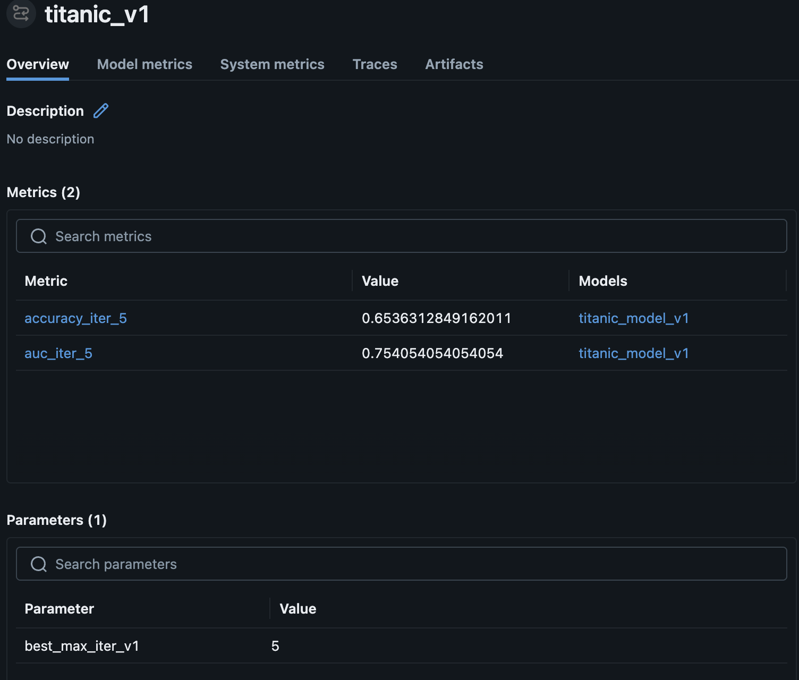
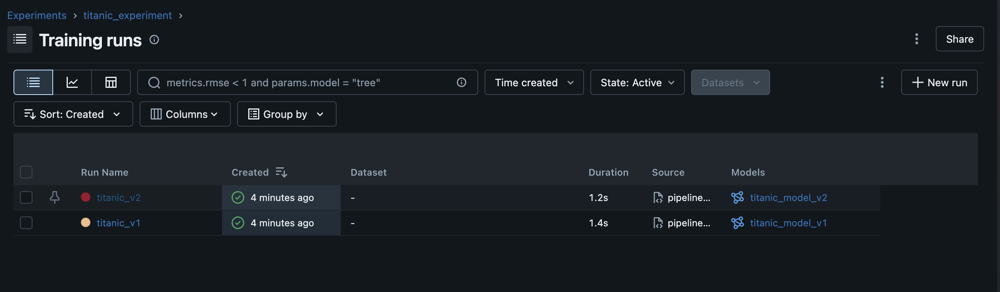

# MLOps lab-3
This is the repo for MLFlow Lab-02. This counts towards the fourth MLOps lab submission for the IE 7374 course

# Titanic Survival Prediction – MLflow MLOps Pipeline

This project demonstrates implementing an end-to-end  MLOps pipeline for predicting the probability of a person surviving. A logistic model has been trained for this lab

---

## Project Structure

- **`src/`** – Contains all the source code for this lab. It contains:
    - **`preprocess.py`**: To preprocess the titanic dataset
    - **`api.py`**: Sends prediction requests to a served ML model
    - **`batch_predict.py`**: Performs a set of batch predictions on the dataset using the registered model 
    - **`register.py`**: Registers trained models in the MLflow Model Registry. It retrieves the run_id and then registers the model in the registry
    - **`train_v1.py`**: TWe train the baseline logistic regression model
    - **`train_v2.py`**: To train the tuned logit model. Hyperparameter tuning has been done on:
        -   Regularisation strength
        - Iterations
    - **`pipeline.py`**: To run the entire pipeline:- preprocess-> train_v1-> register -> train_v2 -> register

- **`requirements.txt`** – Python dependencies required to run the project (`pandas`, `scikit-learn`, `joblib`).

---

## Project Overview

This Lab simulates a production level mlflow workflow. After we run pipeline.py, it first trains model "train_v1" and then promotes it to production. After we finetune the same model as "train_v2" which is then promoted to production

When pipeline.py is executed, the workflow performs the following steps:
- Preprocess the dataset using preprocess.py
- Train the baseline model (train_v1.py)
- Log the experiment, parameters, metrics, and model artifacts to MLflow
- Register the model and promote it to the Production stage in the MLflow Model Registry
- Train the fine‑tuned model (train_v2.py)
- Log the updated experiment to MLflow
- Register the new model version and promote it to Production, replacing the previous version

## MLflow Experiment Tracking

Below are screenshots from the MLflow UI showing the experiment runs and logged metrics.

- This is the screenshot of the logs and metrics of model train_v1

- This is the screenshot of the registry

